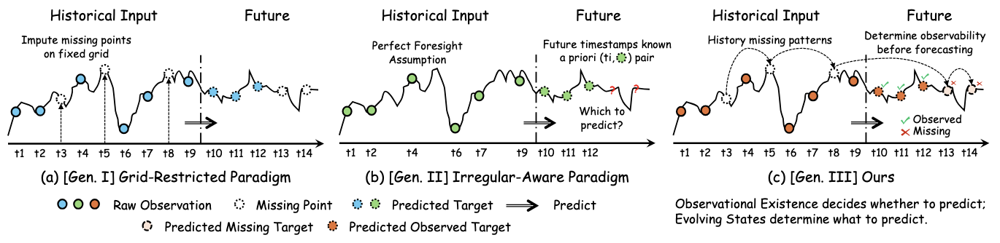
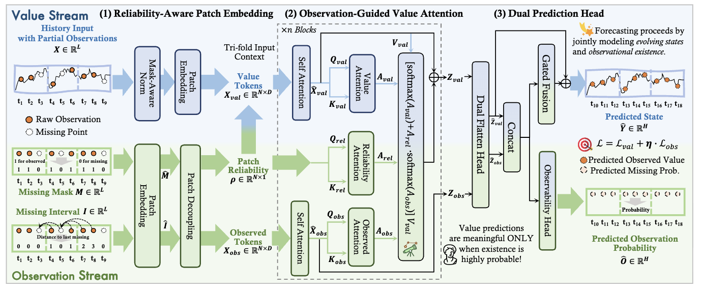

# Existence Precedes Value: Joint Modeling of Observational Existence and Evolving States in Time Series Forecasting
PyTorch Implementation of Timeflies.

## 📰 News

🚩 2026-06-11: Initial upload to arXiv ([PDF](https://arxiv.org/pdf/2606.13571)).

## 🌟 Overview

Real-world time series are often incomplete and irregular, where future observations may not always exist. As shown in the figure below, Timeflies moves beyond the traditional impute-then-forecast paradigm and the irregular-aware paradigm that assumes future timestamps are known. Instead, it introduces an observation-state joint paradigm: first infer whether a future observation will occur, and then predict its value only when the observation is likely to be valid.



Timeflies follows a dual-stream pipeline to jointly model observational existence and evolving states. The observation stream captures missingness patterns from masks and missing intervals, while the value stream models temporal dynamics. Through reliability-aware patch embedding, observation-guided value attention, and a dual prediction head, Timeflies produces both future observation probabilities and value forecasts, making predictions more suitable for real-world irregular time series.



## 📚 Citation
If you find this repo useful, please consider citing our paper as follows:
```bibtex
@article{hu2026existence,
      title={Existence Precedes Value: Joint Modeling of Observational Existence and Evolving States in Time Series Forecasting}, 
      author={Yifan Hu and Hongzhou Chen and Peiyuan Liu and Yiding Liu and Zewei Dong and Jiang-Ming Yang},
      journal={arXiv preprint arXiv:2606.13571},
      year={2026}
}
```

## 🙏 Acknowledgement
Special thanks to the following repositories for their invaluable code and datasets:

- [Time-Series-Library](https://github.com/thuml/Time-Series-Library)
- [PatchTST](https://github.com/yuqinie98/PatchTST)

## 📩 Contact
If you have any questions, please contact [huyf0122@gmail.com](huyf0122@gmail.com) or submit an issue.
